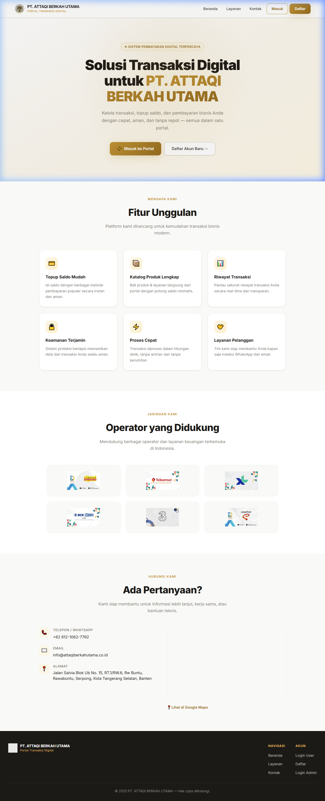
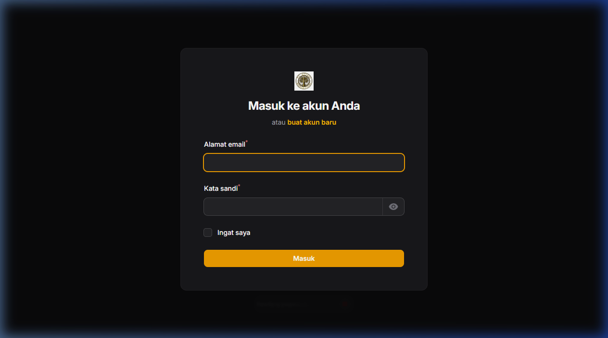
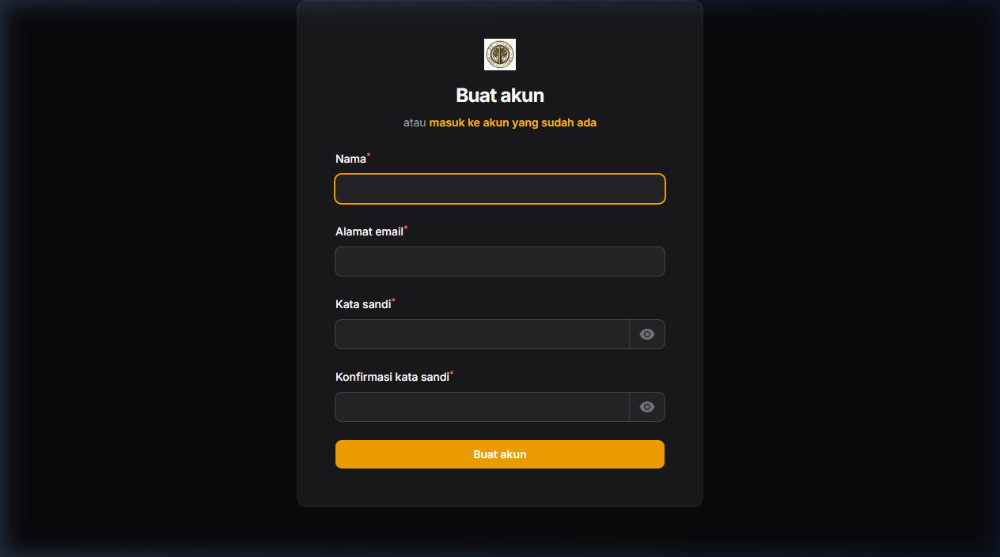
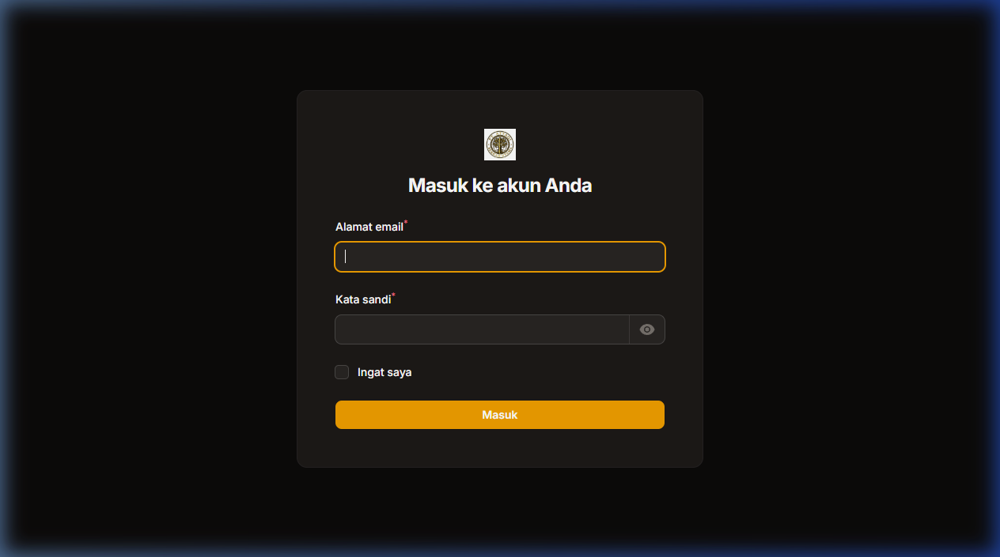

# 🌿 Portal Transaksi Digital — PT. ATTAQI BERKAH UTAMA

Aplikasi **Portal Transaksi Digital** berbasis web untuk **PT. ATTAQI BERKAH UTAMA**. Memungkinkan pengguna untuk melakukan **topup saldo**, **membeli produk/layanan**, serta **melihat riwayat transaksi** dan **kritik & saran**. Admin dapat mengelola seluruh data melalui panel admin Filament.

Dibangun dengan **Laravel 11** + **Filament 3** + **TriPay Payment Gateway**.

---

## 📋 Daftar Isi

- [Teknologi](#-teknologi)
- [Fitur](#-fitur)
- [Prasyarat](#-prasyarat)
- [Instalasi & Setup](#️-instalasi--setup)
- [Cara Topup Saldo (Alur Lengkap)](#-cara-topup-saldo-alur-lengkap)
- [Akun Default Admin](#-akun-default-admin)
- [Struktur Proyek](#-struktur-proyek)
- [Perubahan Terbaru](#-perubahan-terbaru)

---

## 📦 Teknologi

| Teknologi | Keterangan |
|---|---|
| **Laravel 11** | Framework PHP utama |
| **Filament 3** | Admin panel & user panel |
| **SQLite** | Database (bawaan, tanpa konfigurasi server) |
| **TriPay API** | Payment gateway untuk topup saldo |
| **TailwindCSS CDN** | Styling halaman depan |
| **Inter (Google Fonts)** | Tipografi premium |

---

## ✨ Fitur

### 👤 Portal User (`/user`)
| Fitur | Keterangan |
|---|---|
| **Registrasi & Login** | Buat akun dan masuk ke portal |
| **Lihat Saldo** | Saldo tampil di header panel secara real-time |
| **Topup / Deposit** | Isi saldo via VA Bank, QRIS, Alfamart, Indomaret |
| **Beli Produk** | Beli produk dari katalog, potong saldo otomatis |
| **Riwayat Transaksi** | Lihat semua transaksi pembelian produk |
| **Kritik & Saran** | Kirim feedback ke admin |

### 🔧 Panel Admin (`/admin`)
| Fitur | Keterangan |
|---|---|
| **Manajemen User** | Lihat & kelola semua akun pengguna |
| **Manajemen Produk** | Tambah, edit, hapus produk + upload gambar |
| **Kelola Transaksi** | Konfirmasi & update status transaksi |
| **Monitor Deposit** | Pantau semua topup saldo masuk |
| **Metode Pembayaran** | Kelola metode pembayaran |
| **Kritik & Saran** | Lihat & tanggapi feedback pengguna |
| **Dashboard Rekap** | Statistik total saldo, transaksi, dll |

---

## 🔧 Prasyarat

Pastikan sudah terinstal di komputer:

- **PHP >= 8.2** → cek: `php -v`
- **Composer** → cek: `composer -V`
- **Node.js** (opsional, untuk compile assets) → cek: `node -v`
- **Git** → cek: `git --version`

---

## ⚙️ Instalasi & Setup

### 1. Clone Repository

```bash
git clone <url-repository-ini> Kritik-main
cd Kritik-main
```

### 2. Install Dependencies PHP

```bash
composer install
```

### 3. Buat File Konfigurasi `.env`

```bash
cp .env.example .env
```

Lalu generate application key:

```bash
php artisan key:generate
```

### 4. Konfigurasi `.env`

Buka file `.env` dan pastikan pengaturan berikut sudah benar:

```env
APP_NAME=Laravel
APP_URL=http://localhost:8000

# Database — default pakai SQLite (tidak perlu install MySQL)
DB_CONNECTION=sqlite

# WAJIB: Ganti ke "public" agar gambar produk bisa tampil
FILESYSTEM_DISK=public

# TriPay — untuk payment gateway topup saldo
TRIPAY_API_KEY=DEV-xxxxxxxxxxxxxxxx
TRIPAY_PRIVATE_KEY=xxxxx-xxxxx-xxxxx-xxxxx-xxxxx
TRIPAY_MERCHANT_CODE=Txxxxx
TRIPAY_IS_PRODUCTION=false   # ganti true kalau sudah produksi
```

> **Catatan TriPay**: Daftar akun di [tripay.co.id](https://tripay.co.id) untuk mendapatkan API Key production. Mode `false` = sandbox (testing).

### 5. Buat File Database SQLite

```bash
# Windows PowerShell:
New-Item -Path "database/database.sqlite" -ItemType File -Force

# Linux / Mac:
touch database/database.sqlite
```

### 6. Jalankan Migrasi Database

```bash
php artisan migrate
```

### 7. Buat Storage Link (WAJIB untuk gambar produk)

```bash
php artisan storage:link
```

Perintah ini membuat symlink `public/storage → storage/app/public`, sehingga gambar yang diupload admin bisa ditampilkan di browser.

### 8. Buat Akun Admin Pertama

```bash
php artisan make:filament-user
```

Ikuti prompt yang muncul:
```
Name: Admin
Email: admin@attaqi.com
Password: password123
```

Lalu, set role-nya menjadi `admin` via database atau tinker:

```bash
php artisan tinker
```

```php
# Di dalam tinker:
App\Models\User::where('email', 'admin@attaqi.com')->update(['role' => 'admin']);
exit
```

### 9. Jalankan Server

```bash
php artisan serve
```

Buka browser → **http://localhost:8000**

---

## 💰 Cara Topup Saldo (Alur Lengkap)

Topup saldo menggunakan **TriPay Payment Gateway**. Berikut alurnya:

### Langkah User (di portal `/user`):

1. **Login** ke portal user → http://localhost:8000/user/login
2. Klik menu **"Deposit / Topup"** di sidebar kiri
3. Klik tombol **"Buat Deposit"** (pojok kanan atas)
4. Isi form:
   - **Jumlah Topup** → minimal Rp 10.000
   - **Metode Pembayaran** → pilih VA Bank / QRIS / Alfamart / Indomaret
5. Klik **"Simpan"** → sistem otomatis membuat tagihan di TriPay
6. Di tabel deposit, klik tombol **"Bayar Sekarang"** → redirect ke halaman pembayaran TriPay
7. Selesaikan pembayaran di halaman TriPay
8. **Saldo otomatis masuk** ke akun setelah pembayaran dikonfirmasi TriPay (via webhook)

### Alur Teknis Webhook:

```
User bayar di TriPay
        ↓
TriPay kirim notifikasi ke: http://yourapp.com/tripay/callback
        ↓
Sistem verifikasi signature TriPay
        ↓
Status deposit diupdate → "success"
        ↓
Saldo user bertambah otomatis
```

### Konfigurasi Webhook di Dashboard TriPay:

Masuk ke dashboard TriPay → **Merchant → Callback URL**, isi dengan:
```
https://domain-anda.com/tripay/callback
```

> ⚠️ **Penting**: Untuk testing lokal, gunakan **ngrok** agar webhook TriPay bisa sampai ke localhost:
> ```bash
> ngrok http 8000
> # Salin URL ngrok → paste ke Callback URL di dashboard TriPay
> ```

---

## 🔑 Akun Default Admin

Setelah setup, buat akun admin manual via `php artisan tinker`:

```php
App\Models\User::create([
    'name'     => 'Admin ATTAQI',
    'email'    => 'admin@attaqi.com',
    'password' => bcrypt('password123'),
    'role'     => 'admin',
    'saldo'    => 0,
]);
```

| Panel | URL | Credential |
|---|---|---|
| Admin | http://localhost:8000/admin | admin@attaqi.com / password123 |
| User | http://localhost:8000/user | daftar via /user/register |

---

## 📁 Struktur Proyek

```
Kritik-main/
├── app/
│   ├── Filament/
│   │   ├── Resources/          ← Admin panel resources
│   │   │   ├── ProductResource.php
│   │   │   ├── DepositResource.php
│   │   │   ├── TransaksiResource.php
│   │   │   ├── UserResource.php
│   │   │   └── KritikSaranResource.php
│   │   └── User/
│   │       └── Resources/      ← User panel resources
│   │           ├── ProductResource.php   (katalog + beli)
│   │           ├── DepositResource.php   (topup saldo)
│   │           ├── TransaksiResource.php (riwayat)
│   │           └── KritikSaranResource.php
│   ├── Models/                 ← Eloquent Models
│   │   ├── User.php
│   │   ├── Product.php
│   │   ├── Deposit.php
│   │   ├── Transaksi.php
│   │   └── Kritik_saran.php
│   ├── Providers/
│   │   └── Filament/
│   │       ├── AdminPanelProvider.php   ← konfigurasi panel admin
│   │       └── UserPanelProvider.php    ← konfigurasi panel user
│   └── Services/
│       └── TriPayService.php            ← integrasi TriPay API
├── database/
│   ├── migrations/             ← struktur tabel database
│   └── database.sqlite         ← file database SQLite
├── public/
│   ├── images/                 ← logo & gambar statis
│   └── storage -> ../storage/app/public  ← symlink gambar upload
├── resources/views/
│   └── about.blade.php         ← halaman landing page
├── storage/app/public/
│   └── products/               ← gambar produk yang diupload
└── .env                        ← konfigurasi aplikasi
```

---

## 🔄 Perubahan Terbaru

### v2.0 — Rebranding PT. ATTAQI BERKAH UTAMA

| Komponen | Perubahan |
|---|---|
| **Nama Perusahaan** | Diganti dari "PT. Digital Komunikasi Nusantara" → **PT. ATTAQI BERKAH UTAMA** |
| **Logo** | Logo baru PT. ATTAQI BERKAH UTAMA (putih & emas) |
| **Warna Tema** | Dari biru → **putih + emas (Amber)** di seluruh panel & landing page |
| **Landing Page** | Desain baru — clean, modern, premium; background putih + aksen emas |
| **Bug Fix: Gambar Produk** | `FILESYSTEM_DISK` diubah dari `local` → `public` sehingga gambar produk yang diupload kini tampil |
| **Storage Link** | `php artisan storage:link` dijalankan → symlink aktif |
| **Admin Panel Brand** | Brand name, logo, dan warna diupdate |
| **User Panel Brand** | Brand name, logo, dan warna diupdate |

---

## ❓ Troubleshooting

### Gambar Produk Tidak Tampil
```bash
# Pastikan storage link sudah dibuat
php artisan storage:link

# Pastikan .env punya:
FILESYSTEM_DISK=public
```

### Webhook TriPay Tidak Masuk (Lokal)
```bash
# Install & jalankan ngrok
ngrok http 8000
# Salin URL https://xxx.ngrok.io → isi di Callback URL TriPay dashboard
```

### Error "Class not found" setelah git pull
```bash
composer install
php artisan config:clear
php artisan cache:clear
```

### Database kosong / tabel belum ada
```bash
php artisan migrate
```

---

## 📸 Tampilan Website

### 🏠 Halaman Utama (Landing Page)


---

### 🔐 Login User


---

### 📝 Registrasi Akun


---

### 🔑 Login Admin


---

## 📄 Lisensi

© 2025 **PT. ATTAQI BERKAH UTAMA** — Hak cipta dilindungi. Dibuat untuk keperluan internal perusahaan.
